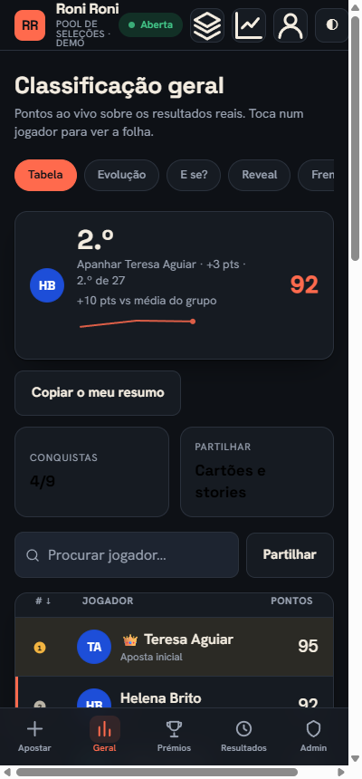
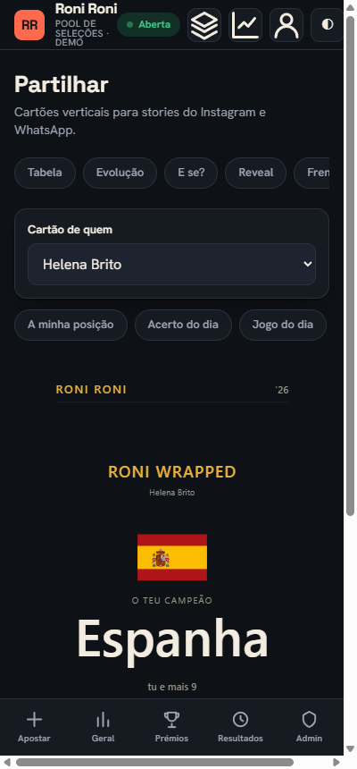
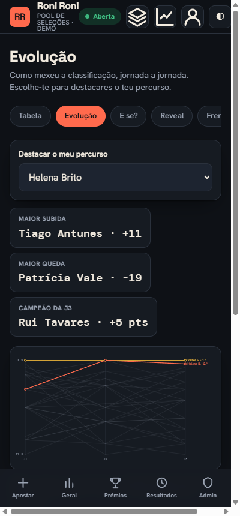

# Roni Roni

App web de um pool de apostas do Mundial 2026 entre amigos. Veio substituir a folha de Excel que
o grupo usava: cada pessoa faz a aposta no telemóvel e segue a classificação ao vivo à medida que
saem os resultados reais, da fase de grupos à final.

O repositório traz uma edição de demonstração com 27 jogadores fictícios e os resultados reais do
torneio, por isso a app funciona à primeira em qualquer clone.

<p align="center">
  
  
  
</p>
<p align="center">
  
  
</p>

## Funcionalidades

- **Aposta por passos no telemóvel**: campeão, Final 4, 1.º e 2.º de cada grupo e os 8 melhores
  terceiros, com validação à medida que se preenche e resumo antes de confirmar. PIN opcional
  para proteger a aposta.
- **Mata-mata ronda a ronda**: quando o admin abre uma ronda, aposta-se o vencedor de cada jogo e
  a forma como acaba (tempo regulamentar, prolongamento ou penáltis), com 2 jokers que duplicam
  os pontos de um jogo.
- **Classificação ao vivo**: ordenável, com pesquisa, movimento de posições e reordenação animada.
  Cada linha abre a folha do jogador com a origem de cada ponto.
- **Camada social**: evolução das posições por jornada com recaps, simulador "e se?", reveal do
  consenso do grupo, frente a frente entre dois jogadores (grupos e mata-mata), conquistas com
  níveis, e um Hall da Fama que agrega todas as edições.
- **Partilha**: cartões verticais 9:16 para stories (a minha posição, acerto do dia, jogo do dia e
  sticker transparente) e o **Roni Wrapped**, um recap pessoal em formato story com barras de
  progresso, bandeiras e partilha nativa. Tudo gerado no browser, sem serviços externos.
- **Multi-edições**: cada competição vive na sua pasta, com histórico, importação de edições
  passadas e um construtor de competições novas na administração (serve para um Euro, uma
  Champions ou o que for, com formato e pontos configuráveis).
- **Identidade sem passwords**: cada pessoa reivindica o seu nome uma vez e fica identificada no
  dispositivo por token, com um código de 6 dígitos para ligar outros dispositivos.
- **Administração**: resultados de grupos e mata-mata (com gravação em lote e correção de
  enganos), janelas de aposta por ronda, mercados extra e a grelha de apostas de toda a gente.
- **Resultados reais da ESPN** sem chave de API, ou inseridos à mão. Tema claro, escuro e alto
  contraste; interface mobile-first e acessível.

## Stack

Node.js 20+, sem dependências. O servidor assenta no módulo `node:http` e guarda o estado em
ficheiros JSON (com cópia de segurança e escrita atómica). O frontend é uma SPA em JavaScript
puro, sem passo de build.

## Arranque

```bash
git clone https://github.com/upDiogoSaraiva/roni-roni-web.git
cd roni-roni-web
npm start
```

Fica disponível em `http://localhost:4026`. No primeiro arranque o servidor cria o
`data/registry.json` a apontar para a edição de demonstração e o `store.json` respetivo a partir
do `seed.json`. Para voltar ao estado inicial, apaga o `store.json` da edição.

A password de administração por omissão é `roni2026`. Se expuseres a app à internet, define uma
a sério:

```bash
ADMIN_PASSWORD=algobemforte npm start
```

## Configuração

Tudo opcional, por variáveis de ambiente:

| Variável | Por omissão | Para quê |
| --- | --- | --- |
| `PORT` | `4026` | Porta do servidor. |
| `HOST` | `0.0.0.0` | Interface de bind (fica acessível na rede local). |
| `ADMIN_PASSWORD` | `roni2026` | Palavra-passe da administração. Muda-a se a app sair de casa. |
| `RESULTS_SOURCE_URL` | (nenhum) | Feed JSON alternativo para os resultados. |

O login de administração, os PINs e os códigos de identidade têm limite de tentativas por IP
(10 falhadas por 15 minutos) e os tokens de admin expiram ao fim de 12 horas.

## Sistema de pontos

Está implementado a partir do regulamento do grupo, em [`src/scoring.mjs`](src/scoring.mjs).

Na fase de grupos, cada equipa acertada como apurada (1.º, 2.º ou um dos 8 melhores terceiros)
vale 1 ponto, e a posição final certa no grupo vale mais 1. Regras finas, todas com testes:

- Cada jogador só pontua com 8 terceiros; quem indicar mais só vê contar os primeiros, por ordem
  alfabética dos grupos.
- Uma equipa repetida em dois lugares do mesmo grupo só conta uma vez, e o 3.º duplicado não dá
  ponto de posição.
- Alterar os palpites de um grupo depois de o torneio começar perde o bónus de posição desse
  grupo (o apuramento mantém-se).
- Os desempates seguem o regulamento do torneio: confronto direto dentro do grupo e, nos 8
  melhores terceiros, o ranking FIFA antes da ordem alfabética.

No mata-mata aposta-se ronda a ronda:

| Ronda | Vencedor | Forma certa |
| --- | --- | --- |
| 16-avos, 8-avos, quartos | 2 | +1 |
| Meias e 3.º/4.º | 4 | +2 |
| Final | 6 | +3 |

A forma só conta se o vencedor estiver certo. Cada um dos 2 jokers (16-avos a quartos) duplica os
pontos de um jogo. As apostas iniciais valem 8 pontos pelo campeão e 3 por cada seleção do
Final 4. Enquanto os grupos não fecham, a classificação é provisória e refaz-se a cada resultado.

## Fonte de resultados

O botão *Buscar resultados*, na administração, vai buscar os jogos a uma fonte real. Tenta por
esta ordem:

1. `RESULTS_SOURCE_URL`, se estiver definido. Espera um feed JSON no formato
   `{ "groups": { "A": [{ "home": "...", "away": "...", "homeGoals": 0, "awayGoals": 0 }] } }`.
2. A API pública da ESPN (`fifa.world`), que não precisa de chave. É a fonte por omissão, tanto
   para os grupos como para o mata-mata, e cruza as seleções pelo código FIFA.
3. O `results_source.json` da edição, um ficheiro local, caso a fonte online esteja indisponível.

Só entram jogos terminados. O mesmo trabalho dá-se pela linha de comandos com
`node scripts/fetch_results.mjs`, que segue a edição ativa do registry.

## Estrutura do projeto

```
roni-roni-web/
├── server.mjs              servidor HTTP, API e persistência em JSON
├── data/
│   └── competitions/
│       └── demo/           uma pasta por edição:
│           ├── groups.json         as 48 seleções por grupo (A-L)
│           ├── bracket.json        cruzamento oficial do mata-mata
│           ├── competition.json    formato, pontos, fonte e prémios
│           └── seed.json           estado inicial (jogadores e apostas)
├── src/
│   ├── scoring.mjs         pontuação de grupos e mata-mata, com testes
│   ├── bracket.mjs         resolução dos cruzamentos do mata-mata
│   └── results_source.mjs  fonte de resultados ao vivo
├── scripts/                geração dos dados-semente, bandeiras e fetch
└── public/                 SPA (HTML, CSS, JavaScript e bandeiras SVG)
```

O `data/registry.json` (qual é a edição ativa) e o `store.json` de cada edição são estado de
runtime: ficam fora do git e nascem no primeiro arranque. As decisões de design da interface
estão em [`DESIGN_WEB.md`](DESIGN_WEB.md).

## Configurar uma competição

O que é específico de cada edição vive na pasta `data/competitions/<id>/`, e o motor lê tudo a
partir dela:

- [`competition.json`](data/competitions/demo/competition.json): nome e edição, formato
  (`qualifiersPerGroup`, `bestThirds`, `groupGames`), pontos (`champion`, `final4`), fonte de
  resultados (`espnLeague` e datas), mercados extra e os prémios.
- `groups.json`: as seleções por grupo.
- `bracket.json`: o cruzamento do mata-mata (o número de slots de 3.º define quantos terceiros
  apuram).

Para uma edição nova (por exemplo o Euro 2028: 6 grupos, 4 melhores 3.os, fonte `uefa.euro`)
basta criar uma pasta nova com estes ficheiros e apontá-la no `data/registry.json`, ou usar o
construtor de competições na administração, que faz isto tudo por ti. Os nomes e códigos das
seleções estão em [`scripts/teams_meta.mjs`](scripts/teams_meta.mjs).

## Testes

```bash
npm test
```

Os testes cobrem o motor de pontuação: pontos de grupo, desempates por confronto direto, os 8
melhores terceiros com ranking FIFA, o teto de terceiros por jogador, a não dupla contagem, a
pontuação do mata-mata com jokers e a atribuição dos terceiros ao bracket.

## Notas

A edição incluída é de demonstração: os jogadores são fictícios e qualquer semelhança com o grupo
original é só nos pontos. Os dados reais de um pool (nomes, apostas, PINs) vivem fora do git, na
pasta da edição real e no registry locais. As bandeiras vêm do
[flag-icons](https://github.com/lipis/flag-icons) (domínio público). Não há logótipos nem marcas
oficiais do torneio.
