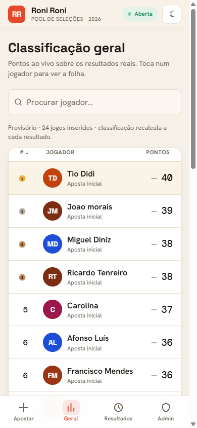
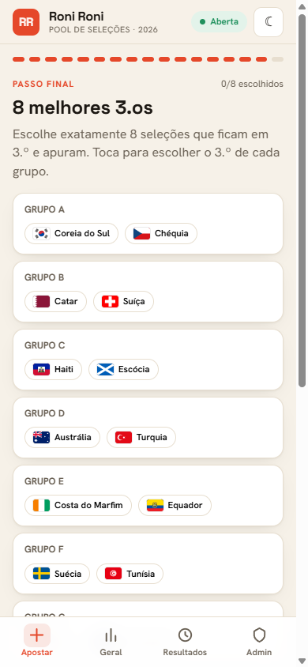
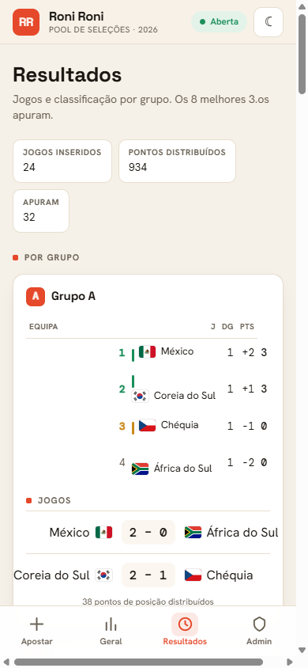

# Roni Roni

Aplicação web do pool de apostas **Torneio Roni Roni** para o Campeonato do Mundo de 2026,
criada para substituir a folha de Excel partilhada do grupo. É *mobile-first*: os participantes
abrem o link no telemóvel, submetem a aposta e acompanham a classificação ao vivo.

<p align="center">
  
  
  
</p>

## Índice

- [Funcionalidades](#funcionalidades)
- [Stack](#stack)
- [Arranque](#arranque)
- [Configuração](#configuração)
- [Sistema de pontos](#sistema-de-pontos)
- [Fonte de resultados](#fonte-de-resultados)
- [Estrutura do projeto](#estrutura-do-projeto)
- [Testes](#testes)
- [Notas](#notas)

## Funcionalidades

- **Submissão de apostas** guiada por passos: campeão, Final 4, 1.º e 2.º de cada grupo e os
  8 melhores 3.os classificados. Validação inline, ecrã de revisão e edição da própria aposta
  (com PIN opcional).
- **Classificação ao vivo**, ordenável e pesquisável, com indicador de movimento e a folha
  pública de cada jogador (incluindo a origem dos pontos).
- **Resultados** por grupo, com a classificação de cada grupo e o quadro do mata-mata.
- **Mata-mata**: apostas ronda a ronda (vencedor, fase — tempo regulamentar, prolongamento ou
  penáltis — e 2 jokers), com o cruzamento oficial do torneio.
- **Administração** protegida por palavra-passe: edição de resultados, abertura e fecho das
  janelas de apostas e grelha com as apostas de todos os participantes.
- **Resultados reais automáticos**, importados de uma fonte pública (ESPN), e tema claro/escuro.

## Stack

Node.js (versão 20 ou superior), **sem dependências externas** — o servidor usa apenas o módulo
`node:http` e persiste o estado num ficheiro JSON. O frontend é uma *single-page application* em
JavaScript, sem passo de *build*.

## Arranque

```bash
git clone https://github.com/upDiogoSaraiva/roni-roni-web.git
cd roni-roni-web
npm start
```

A aplicação fica disponível em `http://localhost:4026`. O estado inicial (`data/store.json`) é
criado no primeiro arranque a partir de `data/seed.json`; para o repor, basta apagar esse ficheiro.

Para regenerar os dados-semente a partir das fontes reais:

```bash
npm run seed
```

## Configuração

Comportamento controlado por variáveis de ambiente (todas opcionais):

| Variável | Por omissão | Descrição |
| --- | --- | --- |
| `PORT` | `4026` | Porta do servidor. |
| `HOST` | `0.0.0.0` | Interface de *bind* (acessível na rede local). |
| `ADMIN_PASSWORD` | `roni2026` | Palavra-passe da área de administração. |
| `RESULTS_SOURCE_URL` | — | Feed JSON alternativo para os resultados (ver abaixo). |

## Sistema de pontos

Implementado de raiz a partir do regulamento, em [`src/scoring.mjs`](src/scoring.mjs).

**Fase de grupos**

- +1 por cada equipa corretamente identificada como apurada (1.º, 2.º ou um dos 8 melhores 3.os).
- +1 por cada posição final correta no grupo.

**Mata-mata** (apostado ronda a ronda)

| Ronda | Vencedor | Fase correta |
| --- | --- | --- |
| 16-avos, 8-avos, quartos | 2 | +1 |
| Meias-finais e 3.º/4.º | 4 | +2 |
| Final | 6 | +3 |

A fase só pontua se o vencedor estiver certo. Cada um dos 2 jokers (16-avos a quartos) duplica os
pontos de um jogo. As apostas iniciais valem 8 pontos pelo campeão e 3 por cada seleção do Final 4.

Durante a fase de grupos a classificação é provisória e recalcula a cada resultado inserido.

## Fonte de resultados

O botão *Buscar resultados* (administração) sincroniza os jogos a partir de uma fonte real, por
esta ordem de prioridade:

1. `RESULTS_SOURCE_URL`, se definido — um feed JSON no formato
   `{ "groups": { "A": [{ "home": "...", "away": "...", "homeGoals": 0, "awayGoals": 0 }] } }`.
2. A API pública da ESPN (`fifa.world`), sem necessidade de chave — usada por omissão para a fase
   de grupos e para o mata-mata. As seleções são associadas pelo código FIFA.
3. `data/results_source.json` como alternativa local, caso a fonte online esteja indisponível.

São importados apenas jogos terminados; nenhum resultado é inventado. O equivalente em linha de
comandos é `node scripts/fetch_results.mjs`.

## Estrutura do projeto

```
roni-roni-web/
├── server.mjs              servidor HTTP, API e persistência em JSON
├── data/
│   ├── groups.json         as 48 seleções por grupo (A–L)
│   ├── bracket.json        cruzamento oficial do mata-mata
│   ├── field_2026_real.csv apostas reais (origem dos dados-semente)
│   └── seed.json           estado inicial gerado
├── src/
│   ├── scoring.mjs         pontuação (grupos + mata-mata) e testes
│   ├── bracket.mjs         resolução dos cruzamentos do mata-mata
│   └── results_source.mjs  fonte de resultados ao vivo
├── scripts/                geração dos dados-semente, bandeiras e fetch
└── public/                 SPA (HTML, CSS, JavaScript e bandeiras SVG)
```

As decisões de design da interface estão documentadas em [`DESIGN_WEB.md`](DESIGN_WEB.md).

## Testes

```bash
npm test
```

A suite cobre o motor de pontuação: pontos de grupo, regra dos 8 melhores 3.os, ausência de
dupla contagem, pontuação do mata-mata com jokers e a atribuição dos 3.os ao bracket.

## Notas

Projeto privado, de uso interno do grupo. Os dados incluem nomes reais dos participantes, pelo que
o repositório deve manter-se privado. As bandeiras (SVG) provêm do projeto de domínio público
[flag-icons](https://github.com/lipis/flag-icons). Não é usado qualquer logótipo ou marca oficial
do torneio.
